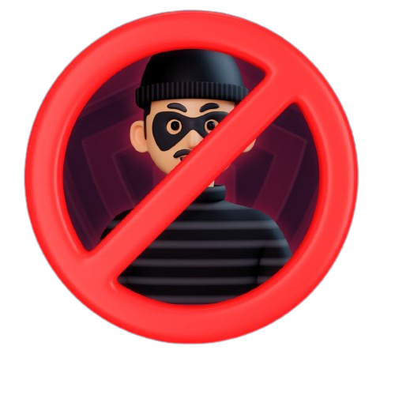
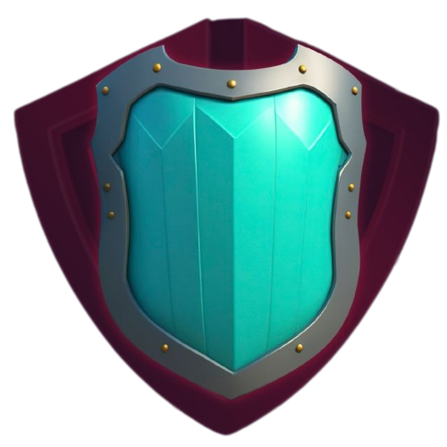
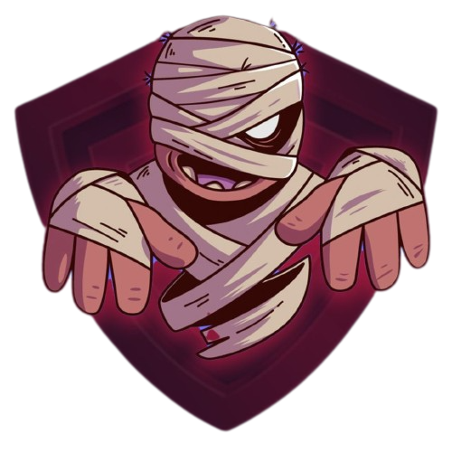
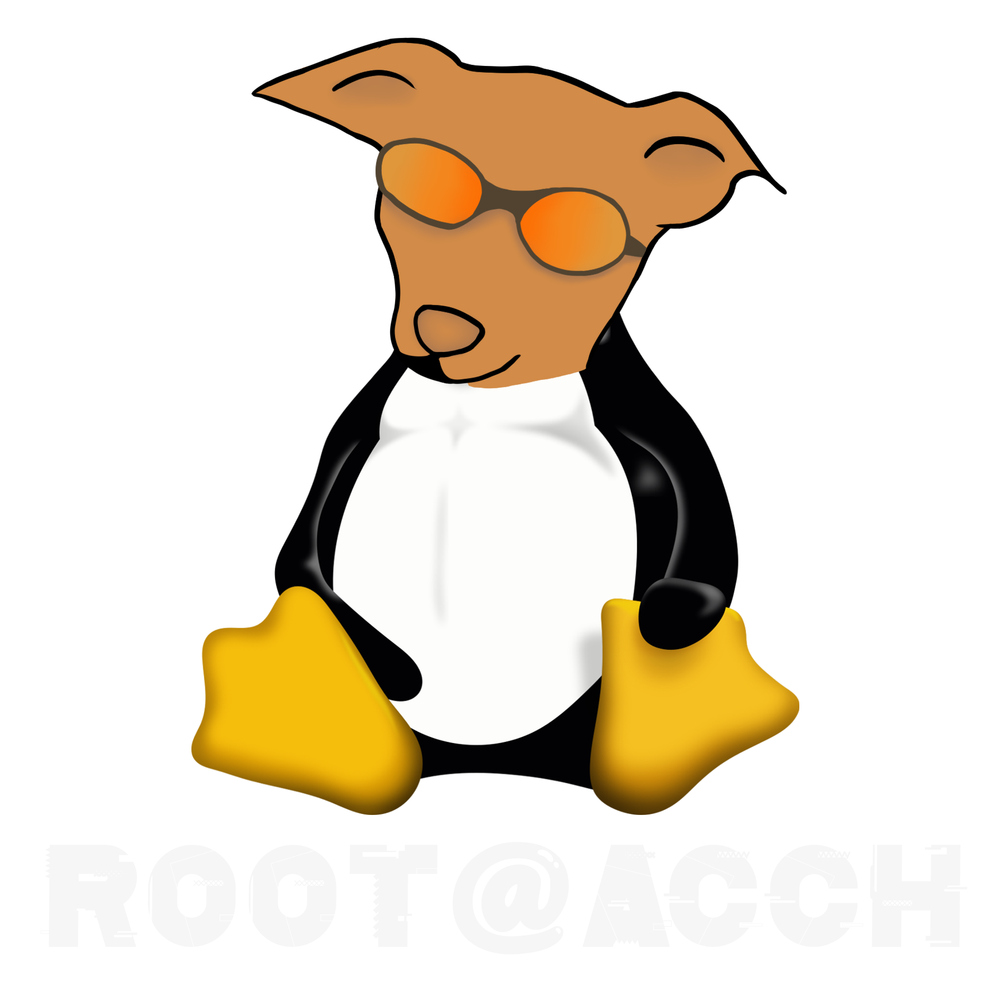

# NotInfecktya


# About

NotInfecktya is a modern cybersecurity solution to defend users and companies from ransomwares👾, made totaly on windows kernel mode.
It counts with a beatiful graphical interface to show the informations for the users around start and stop the driver, open the backup 
folder(Notice that the driver have to be stopped to the user can recover their data), and be able to release the backup space from on disk.
If the company wants to do some programmatic operation on file system, they need to connect on driver and use the interface token, entering in
contact with our team we can provide some code for reference.

# Detection Features

<h3>Infecktya Soldier</h3>
<blockquote>
      <p>
        Our honeypot system works on kernel mode using of windows file listing preference, where it have files with different terms at the beginning of the file like: ._, aa, zz.
        it has three archives with .txt and .docx termination for in the case of ransomware tries to filter the list by extension
        This make the files appear in the beginig or on the end of ransomware's encryption list.
      </p>
</blockquote>


<hr>

<h3>Infecktya Bad_End</h3>
<blockquote>
      <p>
        Our common extension blacklist prevents the creation/renaming of files with a specified ending considered potentially malicious
      </p>
</blockquote>


<hr>
  
<h3>Infecktya Binary Shield</h3>
<blockquote>
      <p>
        Our entropy monitoring compares the old file that is in the backup with the changed one and checks if it was totaly encrypted by magic bytes or if happened a more than two files changes in less than 10 seconds <br>
        <b>
          <h3>obs:</h3>
          <ul><li> if the user wants to make a large change to the files he can use our token to do so </li></ul>
        </b>
      </p>
</blockquote>


<hr>

<h3>BackFromDead</h3>
<blockquote>
      <p>
        our backup which has kernel protection of folders that saves on every write operation of a file where only the user can access the files contained in it turning off the driver via graphical interface <br>
        <b>
          <h3>obs:</h3>
          <ul><li> Clean the backup every now and then... we don't have a self-cleaning mechanism yet</li></ul>
        </b>
      </p>
</blockquote>


# Dependencies

<ul><li>Install .Net 6</li></ul>

# Install / use

Disable Windows protection against unsigned drivers by cmd:
```
bcdedit.exe /set testsigning on
```
<p>Execute NotInfecktyaInstaller.exe to run the setup, after that, open the application and click on "Add Soldiers" to add the decoy files (it takes around 5 minutes).</p>
<p>On complete, click on the button "on" to start the driver and get your token... </p>
<b><p>Now your system are safe, Thanks for choose us!!!😁</p></b>


